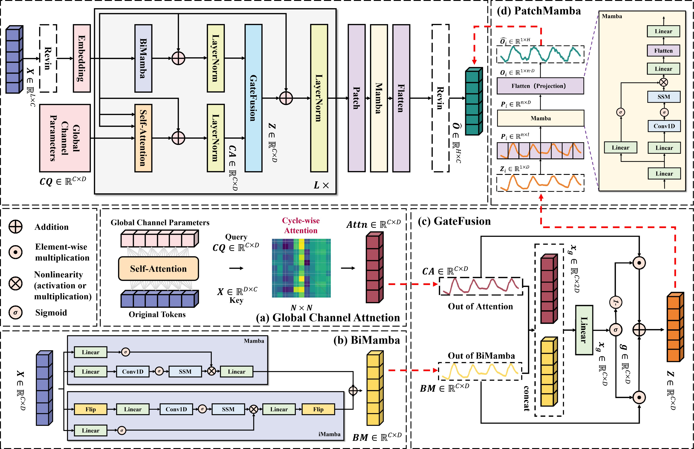
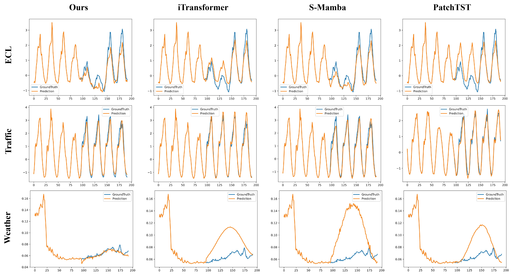

# CQMTformer
If you would like to know more about this model, please refer to our paper.
The manuscript has been accepted for publication in Expert Systems with Applications (ESWA). 

Readers can access the article free of charge using the link provided below:
https://www.sciencedirect.com/science/article/abs/pii/S0957417426028927

The DOI of the article belows:
https://dpi.org/10.1016/j.eswa.2026.133986

If you would like to get a general overview of the model, please refer to the following two figures.

The overall architecture of the model is as follows:

The result of the model is as follows:

The data can be referenced as follows:  
https://github.com/zhouhaoyi/ETDataset  
https://github.com/laiguokun/multivariate-time-series-data
